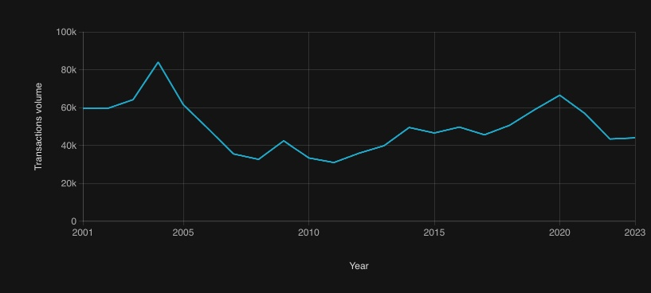
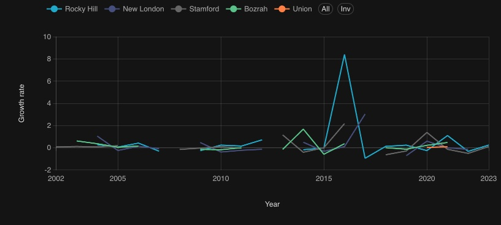
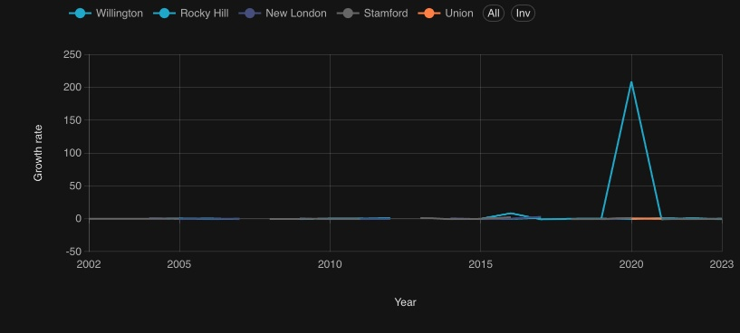
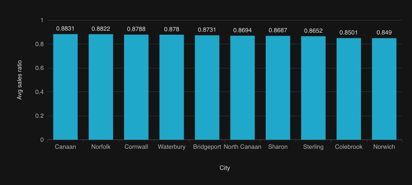
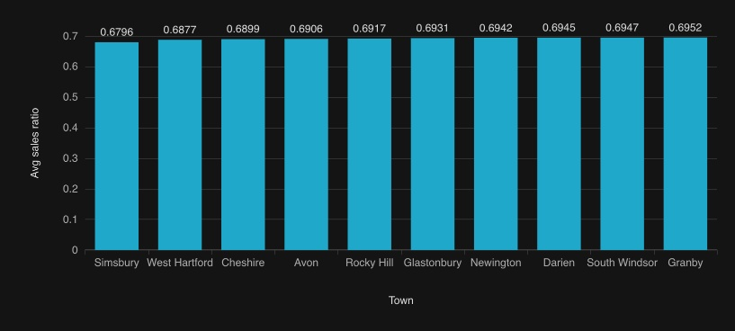
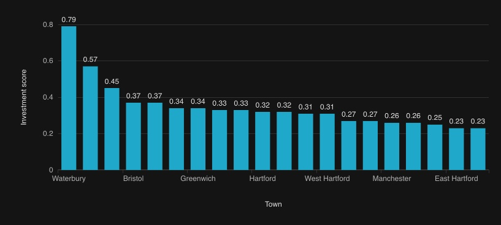
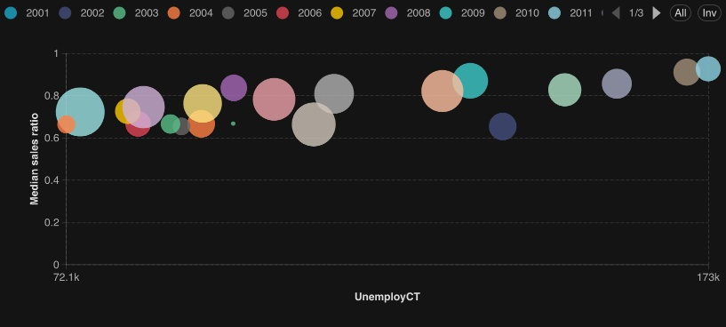

# Real Estate Market Analysis for Investment Potential

## Executive Summary
Connecticut’s real estate market is in a post-recovery slowdown phase, with declining transaction volumes since 2021 indicating reduced liquidity and affordability pressure.  

- Top investment opportunities are concentrated in high-liquidity cities: Waterbury, Bridgeport, and Stamford, offering the best balance of growth, stability, and market activity.  
- Defensive markets*such as Canaan, Norfolk, and Cornwall provide stable, low-volatility options during economic uncertainty.  
- Key risk factors include rising unemployment and borrowing costs, which reduce transaction volume and distort pricing efficiency.  
- High-volatility, low-volume markets (e.g., Willington) present speculative opportunities but carry significant risk due to unstable price signals.  

Bottom line: Focus on liquid, stable cities, diversify with defensive markets, and closely monitor macroeconomic conditions.  

---

## Business Problem
The Connecticut real estate market is shaped by regional differences, cyclical trends, and macroeconomic pressures, making it difficult for investors to clearly identify where to invest and how to manage risk.  

This analysis addresses three key challenges:
1. **Investment Targeting:** Identify cities and neighborhoods with the best risk-adjusted returns, balancing growth, liquidity, and price stability.  
2. **Market Dynamics:** Distinguish between stable (“hot”) markets and undervalued (“cold”) opportunities, while accounting for volatility and anomalies in the data.  
3. **External Impact:** Evaluate how macroeconomic and policy factors (unemployment, affordable housing, household debt) influence prices, transaction activity, and overall market performance.

**Objective:** Provide a clear, data-driven framework to guide investment decisions while accounting for both opportunity and risk.  

---

## Methodology
- Integrated real estate transaction data (2001–2023) with macroeconomic indicators (unemployment, household debt, affordable housing).  
- Cleaned and standardized data (handling missing values, normalizing metrics, removing outliers).  
- Built analytical datasets and performed time-series, correlation, and comparative analysis across cities.  
- Developed key metrics (sales ratio, growth rates, composite investment score) to evaluate market performance.  

**Skills & Tools:**  
- **Data Engineering & Processing:** Apache Airflow  
- **Database & Analytics:** Apache Druid, SQL  
- **Data Visualization:** Apache Superset  
- **Infrastructure:** Docker (Docker Compose)  
- **Data Sources:** Connecticut Open Data, Federal Reserve Bank of St. Louis (FRED), Federal Reserve System  

---

## Results and Business Recommendation

### 1. General Market Trend

Connecticut real estate shows clear cyclical behavior (2001–2023):  
- Expansion (2001–2004) → Contraction (2006–2011) → Recovery (2012–2020) → Slowdown (2021–2023) driven by macro pressures.  

**Interpretation:**  
The market is in a late-cycle moderation phase, creating selective entry opportunities rather than broad-based growth.

### 2. City-Level Growth Dynamics

- **Consistent Growth Leaders:** Stamford, Rocky Hill → sustained appreciation and resilience.  
- **Recovery-Driven Markets:** New London → strong rebound post-2012.  
- **Volatile Small Markets:** Union, Bozrah → large fluctuations with inconsistent performance.  

**Interpretation:** Returns are city-driven, not statewide.  

### 3. Outliers & Risk Signals

- Example: Willington +208× price growth spike in 2020, followed by sharp corrections.  
- Driven by low transaction volume or isolated deals.  

**Interpretation:** High returns possible but risk is disproportionately high; speculative markets are not reliable.  

### 4. Hot vs Cold Markets (Market Efficiency Lens)

- **Hot Markets (High Sales Ratio):** Canaan, Norfolk, Cornwall  
  - Strong alignment between assessed and sale prices  
  - Low volatility, high pricing transparency → Stable, defensive investments  

- **Cold Markets (Low Sales Ratio):** Undervalued or inefficient markets → Higher ROI potential but higher risk  

**Strategic Insight:**  
- Hot markets = income + stability  
- Cold markets = growth + arbitrage  

### 5. Investment Score (Where Capital Should Go)

- **Top-Tier Opportunities:**  
  - Waterbury (0.79) → growth-driven upside  
  - Bridgeport (0.57) → strong liquidity + steady demand  
  - Stamford (0.45) → balanced, low-risk growth  
- **Second-Tier Markets:** Bristol, Stratford, New Haven, Greenwich, Torrington, New Britain, Hartford → moderate performance  

**Interpretation:** Top-performing cities combine growth, transaction volume, and pricing efficiency.  

### 6. Macroeconomic Factor Correlation

- **Unemployment Impact:** Higher unemployment → lower transactions, higher pricing inefficiency; Lower unemployment → stabilization, increased liquidity  
- **Market Sensitivity:** Contractions in 2009–2011; pandemic shock 2020–2021; recovery tied to labor market improvement  

**Interpretation:** Performance is highly sensitive to labor market conditions.  

### 7. Final Business Recommendations
**A. Portfolio Strategy (What to Buy)**  
- **Core (Low Risk – 60–70%):** Stamford, Bridgeport, Canaan → stability, liquidity  
- **Growth Allocation (20–30%):** Waterbury, New London → capture appreciation  
- **Speculative Allocation (≤10%):** Union, Bozrah, Willington → high upside, opportunistic  

**B. Timing Strategy (When to Invest)**  
- Market cooling but not distressed  
- Accumulate gradually; focus on undervalued markets with improving fundamentals  

**C. Risk Management**  
- Avoid low-liquidity towns  
- Prioritize transaction volume  
- Screen out extreme outliers unless speculative  

**D. Macro Monitoring (What to Watch)**  
- Unemployment rate  
- Interest rates  
- Housing policy  

**Key Takeaways:**  
- **Core investment (stable, low-risk):** Stamford, Bridgeport, Canaan, Norfolk, Cornwall  
- **Growth allocation (moderate risk):** Waterbury, New London, Rocky Hill  
- **Avoid or approach cautiously (high-risk):** Willington, Union, Bozrah  

### Next Steps / Future Enhancements
- **Real-Time / Periodic Data Updates:** Automated pipelines for up-to-date dashboards  
- **Predictive Modeling:** Forecast price trends, sales volume, and risk-adjusted ROI  