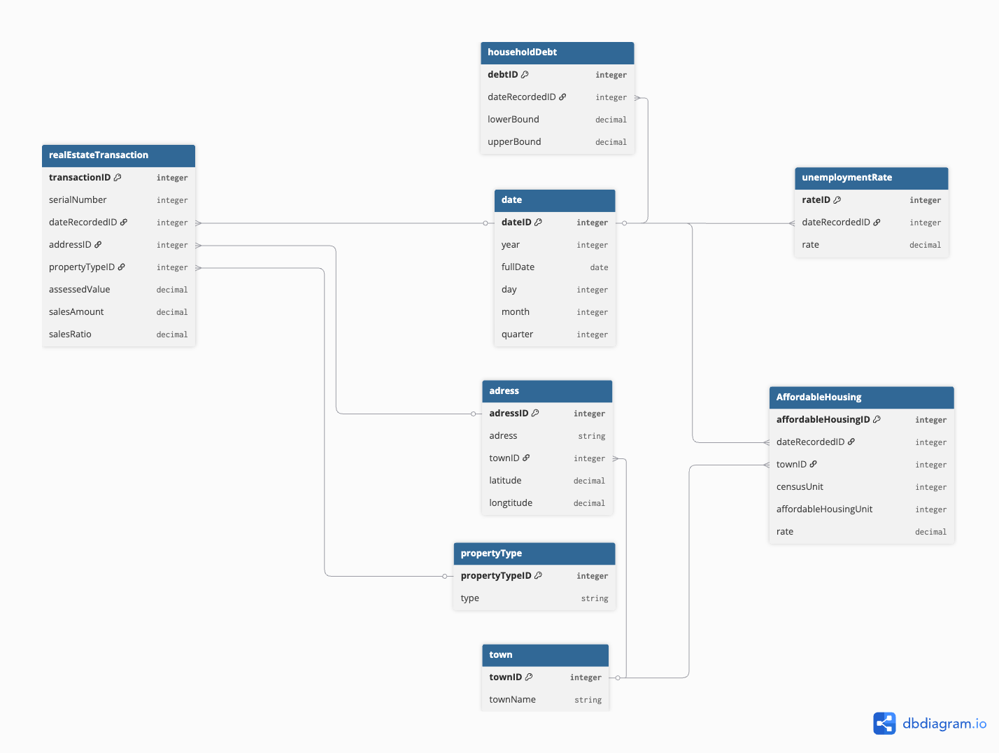

# Data Model

## Original Schema 

### Fact Tables

- **real_estate_transaction**: contains property sales data, including assessed value, sales amount, and sales ratio.
- **household_debt**: shows lower and upper bounds of household debt per date.
- **unemployment_rate**: stores unemployment percentage per date.
- **affordable_housing**: tracks affordable housing units per town and date.

### Dimension Tables

- **date**: full date, day, month, quarter, year.
- **property_type**: type of property.
- **address**: street, town, latitude, longitude.
- **town**: town name and ID.

## Transformation for Druid

For Apache Druid, the schema was flattened into a single table combining the fact and dimension tables.  
This allows fast OLAP queries, aggregation, and analysis in downstream BI tools.